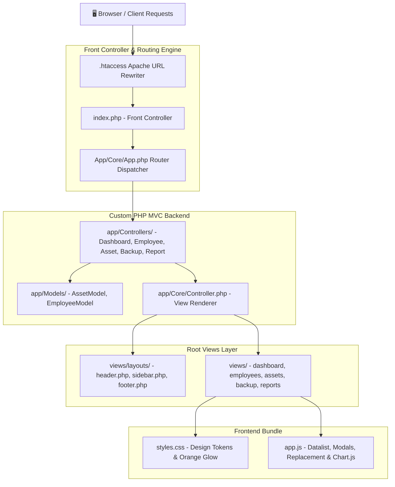
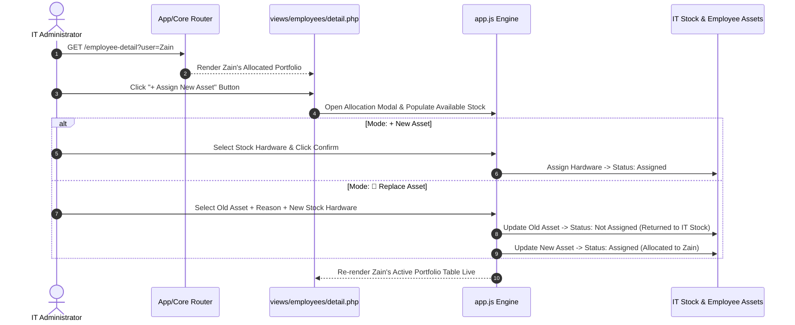

<div align="center">

  <!-- Header Banner / Hero -->
  <p align="center">
    
  </p>

  <!-- Status & Tech Badges -->
  <p align="center">
    <a href="https://github.com/akamaanullah/it-inventory"></a>
    <a href="LICENSE"></a>
    <a href="https://www.php.net/"></a>
    <a href="https://httpd.apache.org/"></a>
    <a href="https://developer.mozilla.org/"></a>
    <a href="https://amaanullah.com"></a>
  </p>

  <p align="center">
    <strong>An enterprise-grade, high-performance IT Asset & Hardware Tracking Suite built with Custom PHP MVC, Vanilla CSS Tokens, Chart.js, and Apache URL Rewriting.</strong>
  </p>

  <!-- Quick Portfolio & Case Study Links -->
  <p align="center">
    <a href="https://amaanullah.com"></a>
    <a href="https://github.com/akamaanullah/it-inventory"></a>
    <a href="https://amaanullah.com/projects/chatrox-real-time-messaging-professional-networking"></a>
    <a href="https://amaanullah.com/projects/hrm-employee-management-payroll-portal"></a>
  </p>

</div>

<br/>

---

## 📌 Table of Contents

<div align="center">

  <p align="center">
    <a href="#-whats-new--key-highlights"></a>
    <a href="#-system-architecture--visual-diagrams"></a>
    <a href="#-core-features--modules-breakdown"></a>
  </p>
  <p align="center">
    <a href="#-pretty-url-routing-table"></a>
    <a href="#-tech-stack--libraries"></a>
    <a href="#-repository-directory-structure"></a>
  </p>
  <p align="center">
    <a href="#-installation--local-setup"></a>
    <a href="#-developer--contact-info"></a>
  </p>

</div>

<br/>

---

## ⚡ What's New & Key Highlights

- 🏢 **Department Filter Tabs**: Interactive directory tabs (`All Departments`, `Production`, `Moneda`, `IT`, `Scrapper`, `Management`, `Finance`, `Calling Agent`) with dynamic member count badges.
- 🔶 **Top-Right Orange Ambient Glow Cards**: Custom glassmorphism employee cards with a soft 270px top-right orange gradient spread covering upper 3/4ths of each card.
- 🖥️ **Dedicated Employee Equipment Portfolios**: Deep-dive user detail view (`/employee-detail?user=Name`) displaying allocated hardware, serials, specs, and attached peripherals.
- 🔍 **Searchable Stock Allocation Datalist**: Integrated live stock lookup input (`<input list="stockDatalistOptions">`) allowing instant search across IT backup stock and unassigned inventory.
- 🔄 **Smart Asset Replacement Workflow**: Toggle between `+ New Asset` and `🔄 Replace Asset`. When replacing hardware, the system automatically returns the old device to IT Stock (`Not Assigned`) with reason logs and allocates the new hardware seamlessly.
- 📦 **Master Inventory Datalist Categories**: Add Asset modal equipped with flexible category typing datalist supporting 14+ equipment types (`LAPTOP`, `DESKTOP`, `TABLET`, `MONITOR`, `PERIPHERAL`, `SERVER`, `PRINTER`, `NETWORKING`, `VOIP`, `CCTV`, etc.) with automatic icon mapping.
- 🌐 **Clean Pretty URLs**: Integrated Apache `mod_rewrite` `.htaccess` routing for clean URL endpoints without `index.php?url=` query params.
- 🏗️ **Root-Level `views/` Custom MVC Architecture**: Clean PSR-4 autoloader, Front Controller dispatcher (`app/Core/App.php`), Base Controller (`app/Core/Controller.php`), and root-level view templates (`views/`).

<div align="right"><a href="#-table-of-contents"></a></div>

---

## 🏗️ System Architecture & Visual Diagrams

### High-Level Architecture Overview



### Hardware Allocation & Replacement Flow



<div align="right"><a href="#-table-of-contents"></a></div>

---

## 🚀 Core Features & Modules Breakdown

| Module | What It Is | Tech Stack | Repository Link |
| :--- | :--- | :--- | :--- |
| **Dashboard Overview** | Live audit metrics, Chart.js deployment analytics, top 5 allocations & CSV exporter. | `PHP 8.x` `Chart.js` `CSS Tokens` | [](http://localhost/it-asset-managment/dashboard) |
| **Employees Directory** | Department filter tabs (`All`, `Production`, `Moneda`, etc.) and ambient orange glow cards. | `Vanilla JS` `CSS Glassmorphism` | [](http://localhost/it-asset-managment/employees) |
| **Employee Portfolio** | Dedicated user device list, searchable stock datalist & hardware replacement engine. | `Custom MVC` `Datalist API` | [](http://localhost/it-asset-managment/employee-detail?user=Zain) |
| **Master Asset Registry** | Master hardware list, 2-column registration modal & custom category datalist. | `PHP MVC` `FontAwesome 6` | [](http://localhost/it-asset-managment/assets) |
| **IT Backup Reserve** | Spare stock sheet for instant device allocation and replacement readiness. | `PHP 8.x` `HTML5` | [](http://localhost/it-asset-managment/backup) |
| **Audit Reports** | Financial asset valuation breakdowns and CSV report generator. | `Chart.js` `CSV Engine` | [](http://localhost/it-asset-managment/reports) |

<div align="right"><a href="#-table-of-contents"></a></div>

---

## 🌐 Pretty URL Routing Table

| Clean Route | Controller | Action Method | Purpose & Function |
| :--- | :--- | :--- | :--- |
| `/dashboard` | `DashboardController` | `index()` | Overview analytics, sparklines & recent 5 allocations |
| `/employees` | `EmployeeController` | `index()` | Department tabs filter & employee card directory |
| `/employee-detail?user=Name` | `EmployeeController` | `detail()` | Dedicated employee portfolio & searchable stock modal |
| `/assets` | `AssetController` | `index()` | Master hardware asset registry & 2-column add modal |
| `/backup` | `BackupController` | `index()` | IT backup stock reserve inventory |
| `/reports` | `ReportController` | `index()` | Departmental spend analytics & CSV exporter |

<div align="right"><a href="#-table-of-contents"></a></div>

---

## 🧰 Tech Stack & Libraries

<div align="center">

  
  
  
  
  
  
  
  

</div>

<br/>

* **Backend Engine**: PHP 8.x (Custom OOP MVC Architecture with PSR-4 Autoloading)
* **Frontend Interface**: Vanilla HTML5 • ES6 JavaScript • Vanilla CSS3 (Custom Design Tokens, HSL Colors & Orange Ambient Radial Glow)
* **Charts & Analytics**: Chart.js 4.x
* **Icons & Fonts**: Plus Jakarta Sans • FontAwesome 6.4.0

<div align="right"><a href="#-table-of-contents"></a></div>

---

## 📁 Repository Directory Structure

```
it-inventory/
├── .htaccess                   # Apache URL Rewriter (Pretty Clean Routes)
├── index.php                   # Front Controller & Autoloader Bootstrap
├── styles.css                  # Core CSS Reset, Design Tokens & Component Utility Classes
├── app.js                      # Frontend Controller, Datasets & Event Listeners
├── app/                        # Core Application Backend (MVC)
│   ├── Controllers/            # MVC Controllers (Dashboard, Employee, Asset, Backup, Report)
│   ├── Core/                   # Router Dispatcher & Base Controller Renderer
│   └── Models/                 # Data Models (AssetModel, EmployeeModel)
└── views/                      # Root-Level View Templates
    ├── layouts/                # Header, Sidebar & Footer Shared Components
    ├── assets/                 # Master Inventory View Page
    ├── backup/                 # Backup Reserve View Page
    ├── dashboard/              # Dashboard Overview Page
    ├── employees/              # Employee Directory & Detail Pages
    └── reports/                # Audit Analytics Page
```

<div align="right"><a href="#-table-of-contents"></a></div>

---

## 📦 Installation & Local Setup

### 1. Requirements
* Web Server (Apache with `mod_rewrite` enabled via XAMPP/WAMP/Linux)
* PHP 8.0 or higher

### 2. Deployment
Clone the repository directly into your web server document root:
```bash
cd C:\xampp\htdocs\
git clone https://github.com/akamaanullah/it-inventory.git it-asset-managment
```

### 3. Enable Apache Rewrite Module
Ensure `mod_rewrite` is active in your `httpd.conf`:
```apache
LoadModule rewrite_module modules/mod_rewrite.so
```

### 4. Run Application
Start Apache server via XAMPP Control Panel and access in your browser:
```http
http://localhost/it-asset-managment/dashboard
```

<div align="right"><a href="#-table-of-contents"></a></div>

---

## 🌐 SEO & Software Engineering Services by Amaanullah

IT Inventory is engineered as part of a high-performance web architecture showcase by **[Amaanullah](https://amaanullah.com)**, specializing in:
* **Custom Enterprise Web Applications**: PHP MVC, Laravel, Node.js, and modern full-stack web platforms.
* **Asset Tracking & ERP Systems**: Hardware lifecycle management, biometric device integrations, and automated inventory audits.
* **HRM & Workspace Automation**: Complete Human Resource Management systems, payroll processing engines, and team collaboration suites.

For technical consulting, custom software development, or enterprise web solutions, visit **[amaanullah.com](https://amaanullah.com)**.

---

## 👨‍💻 Developer & Contact Info

* **Developer Name**: Amaanullah
* **Official Website**: [https://amaanullah.com](https://amaanullah.com)
* **Primary Email**: [akamaanullah@gmail.com](mailto:akamaanullah@gmail.com)
* **Official Contact Email**: [info@amaanullah.com](mailto:info@amaanullah.com)
* **GitHub Profile**: [github.com/akamaanullah](https://github.com/akamaanullah)

---

## 📄 License
This project is released under the **[MIT License](LICENSE)**. See the [LICENSE](LICENSE) file for full details.

---

## 🤝 Contributing
Contributions, issues, and feature requests are welcome! Feel free to open an issue or pull request on [GitHub](https://github.com/akamaanullah/it-inventory).
